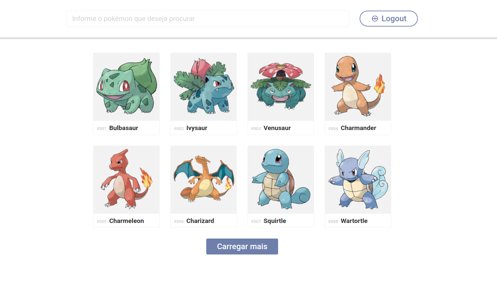

<h3 align="center">
  Pokedex
</h3>
<br>

<h1 align="center">
  
</h1>

## Como instalar

Use [git](https://github.com/lpbborges/pokedex-web.git) clone  para clonar o projeto

```bash
git clone https://github.com/lpbborges/pokedex-web.git
```

## Como executar

### Yarn

```bash
yarn
```

```bash
yarn start
```

### Npm

```bash
yarn
```

```bash
yarn start
```

## Tecnologias utilizadas
[React](https://pt-br.reactjs.org/)<br>
[Styled Components](https://styled-components.com/)<br>
